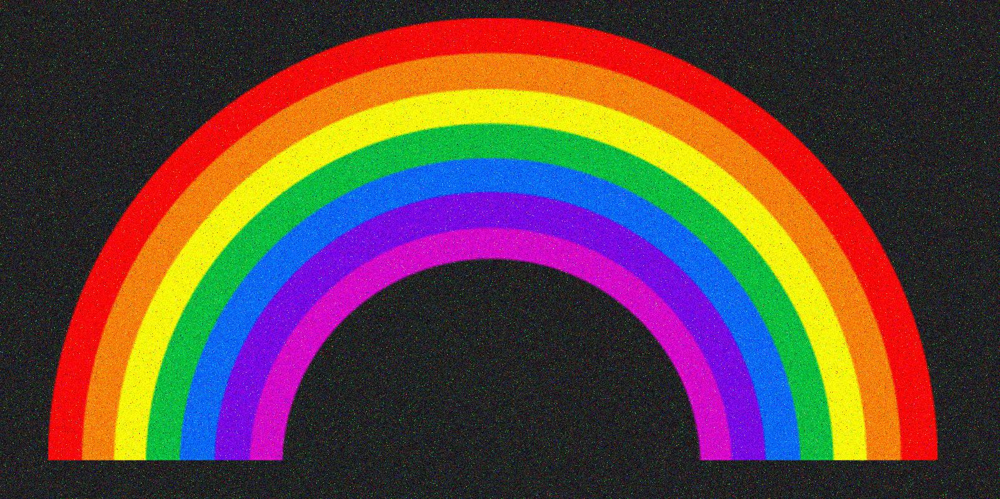

# Gregory vs ChatGPT Image Denoising Challenge

Compare my denoising pipeline against ChatGPT’s output on `rainbow.jpg`.

## Setup

    cd code/gregory-vs-chatgpt-image-denoising-challenge
    conda env create -f environment.yml

## Usage

    conda activate denoising-challenge
    jupyter notebook rainbow-image-denoising-gregory.ipynb

After running this, you’ll see ChatGPT’s static results in the PDF and can open your notebook to review your own pipeline.

## Files

- `rainbow-image-denoising-gregory.ipynb` — my human-written notebook  
- `rainbow-image-denoising-chatgpt.pdf` —  static PDF of ChatGPT outputs
- **images/** — input/output gallery  
  - `rainbow.jpg` — the noisy original  
  - `33final_cleaned_image_hybrid_tv_nlm.png` — my final cleaned output
  
## Visual Workflow

| Original (`rainbow.jpg`) | Final Cleaned Output |
|:------------------------:|:--------------------:|
|  |  |

## Notes

- **License**: All rights reserved — for viewing purposes only.  
